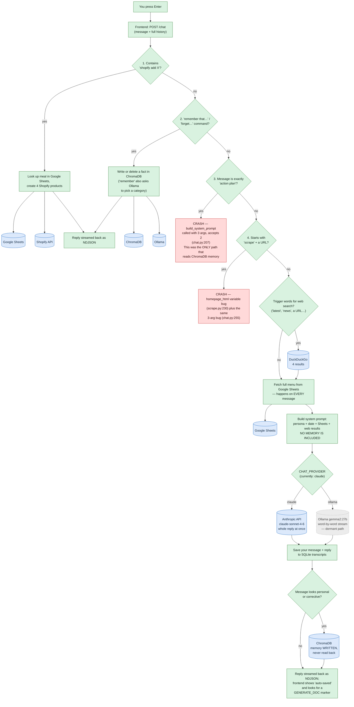
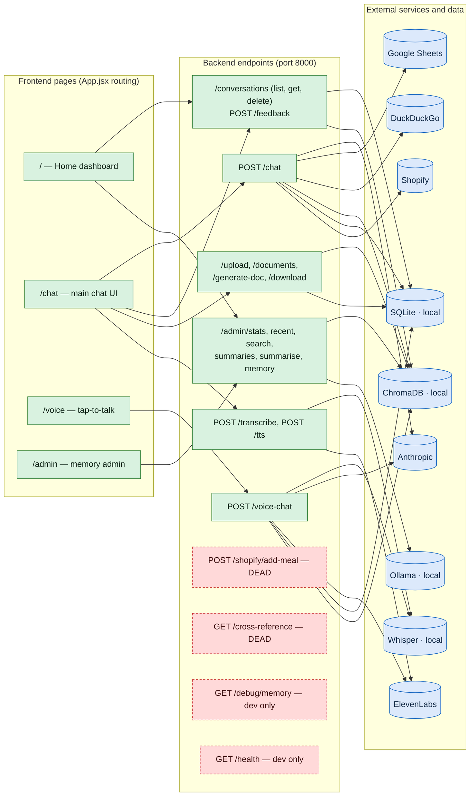

# Lucchese — Full Repo Audit

*Generated 5 August 2026. Read-only analysis — no code was changed. Every claim cites the file and line it came from, or the search that came up empty.*

---

## 1. How to read this report

Every file and feature gets one of four labels:

| Label | Meaning |
|---|---|
| ✅ **USED** | Actively part of the running app. I say what it does and when it runs. |
| 💀 **UNUSED** | The app never touches it. Safe to delete (evidence given). |
| 🚧 **HALF-FINISHED** | Partially wired in: set up but never called, called but broken, or referencing code that no longer exists. |
| 🔧 **DEV-ONLY** | Not part of the app itself — tooling, scripts you run by hand, or config for development. |

**Plain-English rule:** every technical term is explained the first time it appears, in *italics like this*. Terms used throughout:

- ***Backend*** — the Python server (`backend/`, built with *FastAPI*, a Python web framework). It runs on your machine on port 8000 and does all the thinking.
- ***Frontend*** — the website (`frontend/`, built with *React*, a JavaScript UI library, and served by *Vite*, a development web server). It's just the screen; every real action is a network request to the backend.
- ***Endpoint*** — one URL the backend answers, e.g. `POST /chat` means "send a chat message here." A ***router*** is a group of endpoints defined in one file.
- ***LLM*** — large language model; the AI that writes the replies (Claude or a local model).
- ***Ollama*** — a program that runs LLMs locally on your own PC instead of calling a cloud API.
- ***ChromaDB*** — a database that stores text as *embeddings* (lists of numbers capturing meaning), so you can search by meaning rather than exact words. This is Lucchese's "memory." It lives in the folder `backend/chroma_db/`, inside your backend — it is not a separate server.
- ***SQLite*** — a simple database stored as a single file (`backend/conversations.db`). It stores the literal chat transcripts (ChromaDB stores the searchable "memories" distilled from them — two separate stores).
- ***RAG*** — "retrieval-augmented generation": look up relevant memories/documents first, paste them into the AI's instructions, then ask it to answer. This is the thing your app *sets up but never actually does* — see Question 3.
- ***System prompt*** — the hidden instruction text sent to the LLM before your message ("You are Lucchese, the personal AI of Alex Hammond…"). Built fresh for every message in `build_system_prompt` ([chat.py:88](backend/routes/chat.py#L88)).
- ***Intercept*** — a shortcut check at the top of the chat endpoint: before doing a normal AI reply, the code checks "is this message actually a command?" (e.g. `shopify add chicken curry`). If yes, it runs special code and skips the normal flow.
- ***NDJSON*** — "newline-delimited JSON": the backend streams the reply as one small JSON object per line (`{"type":"token","content":"Hi"}`), which is how the frontend shows text appearing live.
- ***Environment variable / .env*** — settings and secrets (API keys, which AI provider to use) kept in `backend/.env`, loaded at startup.

---

## 2. The five questions you asked — answered

### Q1. Is the app using `.claude/agents/` at all?

**No. 🔧 DEV-ONLY — and stale.** Those five markdown files (`core.md`, `conversation.md`, `memory-retrieval.md`, `observability.md`, `state-context.md`) are configuration for **Claude Code**, the AI coding tool — they define helper "agents" it can use while *editing* this repo. The app itself never reads them: there is no reference to `.claude` anywhere in `backend/` or `frontend/src` (searched all `.py`/`.jsx` files — zero matches).

They're also out of date: `core.md` says "Read CLAUDE.md before doing anything else" (no `CLAUDE.md` exists in the repo), and the `state-context` agent is a specialist for `routes/state.py` — a file deleted in your July 11 cleanup commit (`2990af5`). Safe to delete the folder, or rewrite it if you want Claude Code helpers that match today's code.

### Q2. Does anything ever write to the `lucchese.context` logger during a chat?

**No. 🚧 HALF-FINISHED.** [main.py:38-83](backend/main.py#L38-L83) carefully sets up the logger (console + rotating file `backend/lucchese.context.log`) and writes exactly **two startup lines per boot** (`context_logging_initialized` and `log_rotation_initialized`). During chat: nothing. At [chat.py:306-307](backend/routes/chat.py#L306-L307) the comment *"STAB-001: emit structured context assembly log before prompt construction"* is still there — but the logging code that belonged under it was deleted. No other file logs to `lucchese.context` (searched: only `main.py` references it; `startup_validator.py` uses a different logger name, and that file is itself dead — see below).

The log file proves it: it contains 84 `context_assembly` events, **the last one dated 2026-06-09**, followed by nothing but 87 startup pairs. So chat logging existed once, was removed in the refactor, and only the scaffolding survived.

### Q3. Does a normal chat message ever READ from ChromaDB memory, or only write?

**Only write. This is the single most important finding in this audit.**

- **Writing works.** After each reply, if your message looks personal or like a correction, the exchange is saved to ChromaDB ([chat.py:381-393](backend/routes/chat.py#L381-L393) → `ingest_exchange` in [memory.py:174](backend/routes/memory.py#L174)). The 👍 button saves too ([conversations.py:84-90](backend/routes/conversations.py#L84-L90)), and "remember that…" saves explicitly.
- **Reading never happens.** The system prompt builder takes exactly two inputs — web results and Google Sheets data: `def build_system_prompt(web_context, sheets_context)` ([chat.py:88](backend/routes/chat.py#L88)). No memory parameter exists. Its own docstring still promises "Tier 1 — profile facts / Tier 2 — episodic ChromaDB memory" sections ([chat.py:96-98](backend/routes/chat.py#L96-L98)) — those sections were deleted; the docstring is a fossil.
- The full retrieval machine **exists and is sophisticated**: `search_memory` ([memory.py:324](backend/routes/memory.py#L324)) searches all five memory collections, asks Ollama to rephrase your query for better matching, re-ranks results with a *cross-encoder* (a small model that scores how relevant each memory is), and adds recency bonuses. **Its only caller in the entire app is the "action plan" intercept ([chat.py:194](backend/routes/chat.py#L194)) — which crashes every time it runs** (see Q-bonus below). Voice chat's memory lookup is literally commented out ([voice.py:135](backend/routes/voice.py#L135): `# ctx = await build_context(user_text)`).

**Net effect: Lucchese diligently files memories it can never recall.** Asking "what have I told you about X?" gets you an answer based only on the current conversation, the hardcoded persona, and the Sheets menu data. Fixing this is the highest-value change available (Section 7).

### Q4. Which endpoints does the frontend actually call, and which are dead?

The frontend makes requests to **17 endpoints** (every `fetch(` call in `frontend/src` was enumerated):

| Endpoint | Called from | When |
|---|---|---|
| `POST /chat` | [App.jsx:495](frontend/src/App.jsx#L495) | Every chat message |
| `GET /conversations` | App.jsx, Home.jsx | Page load, after each reply |
| `GET /conversations/{id}` | [App.jsx:467](frontend/src/App.jsx#L467) | Clicking a conversation in the sidebar |
| `DELETE /conversations/{id}` | [App.jsx:480](frontend/src/App.jsx#L480) | Trash icon on a conversation |
| `POST /feedback` | [App.jsx:155](frontend/src/App.jsx#L155) | 👍/👎 on the latest reply |
| `POST /upload` | [App.jsx:300](frontend/src/App.jsx#L300) | Uploading a PDF/TXT/MD in the Documents panel |
| `GET /documents` | App.jsx, Home.jsx | Opening Documents panel, Home page load |
| `DELETE /documents/{id}` | [App.jsx:312](frontend/src/App.jsx#L312) | Deleting an uploaded document |
| `POST /generate-doc` | [App.jsx:50](frontend/src/App.jsx#L50) | Clicking "Save as Word Doc" (when a reply contains the `[GENERATE_DOC: …]` marker) |
| `GET /download/{token}` | [App.jsx:67](frontend/src/App.jsx#L67) | Downloading the generated .docx |
| `POST /transcribe` | [App.jsx:627](frontend/src/App.jsx#L627) | Mic button in chat (speech → text into the input box) |
| `POST /tts` | [App.jsx:674](frontend/src/App.jsx#L674) | Voice-mode toggle in chat (reads replies aloud) |
| `POST /voice-chat` | [Voice.jsx:153](frontend/src/Voice.jsx#L153) | The /voice page's tap-to-talk circle |
| `GET /admin/stats` | AdminPanel.jsx, Home.jsx | Admin page + Home page stats |
| `GET /admin/recent`, `GET /admin/search`, `GET /admin/summaries`, `POST /admin/summarise`, `DELETE /admin/memory` | AdminPanel.jsx | Admin page tabs/buttons |

**Endpoints that exist but nothing calls** (no `fetch()` to them anywhere in `frontend/src`):

| Dead endpoint | Defined at | Notes |
|---|---|---|
| `POST /shopify/add-meal` | [shopify.py:92](backend/routes/shopify.py#L92) | 💀 The chat intercept calls the underlying `add_meal()` function directly, so the endpoint wrapper is redundant. |
| `GET /cross-reference` | [shopify.py:113](backend/routes/shopify.py#L113) | 💀 as an endpoint — but the underlying function *is* used: asking chat about "missing ingredients" triggers it via Sheets context ([sheets.py:293](backend/sheets.py#L293)). |
| `GET /debug/memory` | [admin.py:253](backend/routes/admin.py#L253) | 🔧 Dev inspection tool (needs admin key). Fine to keep or delete. |
| `GET /health` | [files.py:146](backend/routes/files.py#L146) | 🔧 Useful for manual "is it up?" checks / uptime monitors, but nothing in the app uses it. |

Also: **six route files exist but only six routers are mounted** in [main.py:103-108](backend/main.py#L103-L108) (chat, admin, conversations, files, voice, shopify). `config.py`, `database.py`, `documents.py`, `memory.py` are used as libraries (imported by the mounted routes), `scrape.py` declares a `router` with zero endpoints on it ([scrape.py:22](backend/routes/scrape.py#L22) — harmless leftover), and `startup_validator.py` is imported by nothing at all.

### Q5. Which external services are actually exercised, and which are dormant?

Your current setting is `CHAT_PROVIDER=claude` in `backend/.env`, which decides a lot below.

| Service | Status | Evidence |
|---|---|---|
| **Anthropic (Claude)** | ✅ Runs **every chat and voice reply**. Model hardcoded to `claude-sonnet-4-6` in 4 places ([chat.py:219](backend/routes/chat.py#L219), [267](backend/routes/chat.py#L267), [338](backend/routes/chat.py#L338), [voice.py:158](backend/routes/voice.py#L158)). Note: the Claude path does **not** stream — it waits for the whole reply, then sends it as one chunk. Only the Ollama path streams word-by-word. |
| **Google Sheets** | ✅ Hit on **every single chat message** — `get_menu_context` ([chat.py:304](backend/routes/chat.py#L304) → [sheets.py:204](backend/sheets.py#L204)) makes two live Sheets API calls (Standard + Bulking recipes) before anything else, whether or not your message is about food. Also: `sheets.py` connects at *import time* (lines 8-11) — if `credentials.json` is missing or Google is unreachable, **the whole backend fails to boot**. |
| **Ollama (local LLM)** | ✅ but only in the background now: categorising "remember that…" facts ([memory.py:108](backend/routes/memory.py#L108)), the Admin "Summarise" button ([admin.py:200](backend/routes/admin.py#L200)), and query rephrasing inside the never-reached `search_memory`. Since `CHAT_PROVIDER=claude`, it no longer writes chat replies. `start.bat` still boots it — correct, because "remember" and Summarise silently degrade without it. |
| **Whisper (local speech-to-text)** | ✅ Mic button (`/transcribe`) and voice page (`/voice-chat`). The `tiny` model (fastest, least accurate) is loaded when the backend starts ([config.py:29](backend/routes/config.py#L29) — the TODO comment about it blocking startup is still there). |
| **ElevenLabs (text-to-speech)** | ✅ `/tts` (voice-mode toggle in chat) and `/voice-chat`. Skipped gracefully if the API key is unset ([config.py:25](backend/routes/config.py#L25)). |
| **DuckDuckGo (web search)** | ✅ On trigger words only — "latest", "news", "score", a URL in the message, etc. ([chat.py:46-68](backend/routes/chat.py#L46-L68)). Failures return empty silently. |
| **Shopify** | ✅ but narrow: only the `shopify add <meal>` chat command ([chat.py:173](backend/routes/chat.py#L173)) → creates 4 products ([shopify_api.py:70](backend/shopify_api.py#L70)). Uses `SHOPIFY_STORE` / `CLIENT_ID` / `CLIENT_SECRET` from `.env`. |
| **ChromaDB** | ✅ as an embedded library (write-heavy, read-starved per Q3). ⚠️ `chroma_client.py` configures a *different* ChromaDB — a separate server on port 8001 — that the app never uses; only the manual script `check_chroma.py` imports it. |
| **`APPSTLE_API_KEY`** (env var) | 💀 **Dormant.** Zero references to "APPSTLE" in any Python or JS file. (Appstle is a Shopify subscriptions app — presumably a planned integration that never happened.) Safe to remove from `.env`. |
| **`MODEL_DEEP`** (env var, `qwen2.5:32b`) | 💀 **Dormant twice over.** It's only used if a chat request sets `deep: true` ([chat.py:354](backend/routes/chat.py#L354)) — the frontend never sends `deep` (no occurrence in `frontend/src`) — and even then only on the Ollama path, which you're not on. |

---

## 3. Diagram: what happens when you send a chat message

Green = works and runs. Red = crashes when triggered. Grey = configured but effectively dormant. Blue = external service touched.

Things worth knowing that the diagram implies:

- The four intercepts run **in order, on every message**, before any AI is involved. They match with regular expressions, so they can misfire: any message containing the word "forget " (e.g. *"don't forget to order chicken"*) matches the forget pattern ([memory.py:457](backend/routes/memory.py#L457)) and will try to **delete** the closest-matching memories instead of chatting.
- "Streaming" is real only on the dormant Ollama path. On Claude, the typing effect you see is the frontend rendering one big chunk.
- The `[GENERATE_DOC: name]` marker is a deal between the system prompt ([chat.py:122-139](backend/routes/chat.py#L122-L139)) and the frontend ([App.jsx:9](frontend/src/App.jsx#L9)): when a reply ends with it, a "Save as Word Doc" button appears, which calls `/generate-doc` → `python-docx` builds a .docx → `/download/{token}` fetches it (link expires after 15 minutes). This whole chain **works**.

---

## 4. Diagram: the whole app at a glance

One quirk: the Home page hardcodes the **production** backend URL `https://api.lucchese.app` ([Home.jsx:3](frontend/src/Home.jsx#L3)) while every other page uses the `VITE_API_URL` setting with production as fallback. If you ever run purely locally, Home's stats will silently come from (or fail against) the live server.

---

## 5. File-by-file classification

### Repo root

| File/folder | Status | What it is / evidence |
|---|---|---|
| `start.bat` | 🔧 | Your launcher: starts Ollama, the backend (uvicorn on 8000), the frontend (Vite on 5173), and a *Cloudflare tunnel* (exposes your PC to lucchese.app). Dev-only but essential. |
| `.gitignore` | 🔧 | Tells git which files to never commit (secrets, databases, logs). Working as intended. |
| `cloudfare id.txt` | 🔧 | 36-byte note holding your tunnel ID. Gitignored. Keep. |
| `Archive/` | 💀 | Graveyard of pre-refactor code: old `deal.py`, `roleplay.py`, `state.py`, import scripts, an old `venv`, `node_modules`, big JSON exports. Nothing imports from it (it's not on the Python path and is gitignored). **Safe to delete entirely** — everything of value is in git history anyway. ~350+ MB reclaimable. |
| `docs/` | 💀 | **Empty folder.** Safe to delete. |
| `.claude/agents/` (5 files) | 🔧 | Claude Code helper-agent definitions. Not read by the app (no code reference). Stale — see Q1. |
| `AUDIT.md` | — | This report. |

### backend/ (root)

| File | Status | What it is / evidence |
|---|---|---|
| `main.py` | ✅ / 🚧 | App entry point: CORS setup (which browsers may call the API), database init, mounts the 6 routers. The 🚧 part is the context logger that only ever logs startup (Q2). |
| `.env`, `credentials.json` | ✅ | Secrets: API keys and the Google service-account file. `credentials.json` is loaded at boot by `sheets.py` — required or the backend won't start. Both gitignored. |
| `requirements.txt` | ✅ | Python dependency list. Minor: it pins **both** `ddgs` and `duckduckgo_search` — the code only imports `ddgs` ([chat.py:26](backend/routes/chat.py#L26)); the other is an older duplicate. |
| `sheets.py` | ✅ | All Google Sheets reading: menu, macros, allergens, ingredient cross-reference, meal costs. Called on every chat message via `get_menu_context` and by the Shopify add-meal flow. |
| `shopify_api.py` | ✅ | Talks to the Shopify Admin API (OAuth token + product creation). Only reached via the `shopify add` chat command. |
| `conversations.db` | ✅ | The SQLite transcript database. Live data, correctly gitignored. |
| `chroma_db/` | ✅ | The ChromaDB memory files. Live data. |
| `generated_docs/` | ✅ | Where generated Word docs sit for their 15-minute download window. Currently empty — normal. |
| `lucchese.context.log` | 🚧 | Output of the half-finished logger. 99% startup noise since June. |
| `imports.db` | 💀 | 18 MB SQLite file from the old ChatGPT/Grok import pipeline. **No reference to `imports.db` in any current code** (the scripts that used it live in `Archive/`). Safe to delete. |
| `chroma_client.py` | 💀 | Connects to a ChromaDB *server* on port 8001 — a different setup than the app uses (the app embeds ChromaDB directly, [memory.py:42](backend/routes/memory.py#L42)). Only `check_chroma.py` imports it. Delete both or keep as dev tools knowingly. |
| `check_chroma.py` | 🔧 | Hand-run script: "is ChromaDB alive, what's in it." Only useful if you run a Chroma server on 8001, which the app doesn't. |
| `inspect_memory.py` | 🔧 | Genuinely useful hand-run CLI for browsing memory collections (`python inspect_memory.py stats / sample / search`). Keep. |
| `export_conversations.py` | 🔧 | Hand-run exporter: dumps `conversations.db` to JSON. Keep. |
| `raw/` | 🔧 | Old ChatGPT export data + `extract.py` (pulls your messages out of a ChatGPT export). One-time import material; archivable. |
| `venv/`, `__pycache__/` | 🔧 | Python's installed packages / compiled cache. Never touch, never commit. |

### backend/routes/

| File | Status | What it is / evidence |
|---|---|---|
| `chat.py` | ✅ / 🚧 | The heart of the app — `POST /chat` with the 4 intercepts and the normal flow. 🚧 parts: the two crashing intercepts (Section 3); a dead import row at [line 27-28](backend/routes/chat.py#L27) (imports `classify_memory`, `is_duplicate_memory`, `col_knowledge/facts/style`, `REMEMBER/FORGET_PATTERNS`, `get_roleplay_session`, `upsert_roleplay_session` — none used in this file; the roleplay ones reference a feature deleted in the refactor); a docstring pointing at `routes/roleplay.py` and `routes/deal.py` which no longer exist ([lines 11-12](backend/routes/chat.py#L11-L12)). |
| `memory.py` | ✅ / 🚧 | All ChromaDB operations. Writing (`ingest_exchange`, `ingest_document`, remember/forget) is ✅ used. `search_memory` + `expand_query` + the cross-encoder reranker are 🚧 — fully built, effectively unreachable (Q3). Loading this module also downloads/loads two ML models at startup (the embedding model and the reranker), which is a chunk of your boot time spent largely on the unused half. |
| `database.py` | ✅ / 🚧 | SQLite layer: conversations, messages, document records — all used. 🚧: the `roleplay_sessions` table and its three helper functions ([lines 168-200](backend/routes/database.py#L168-L200)) belong to the deleted roleplay feature; nothing meaningful calls them. |
| `config.py` | ✅ | Loads env vars, the ElevenLabs client, the Whisper model, and the admin-key check. Note it's imported as a library — its `router` doesn't exist and doesn't need to. The Whisper `tiny` model loads at import time (the in-code TODO flags this). |
| `conversations.py` | ✅ | List/read/delete conversations + the 👍/👎 feedback endpoint. Delete properly purges both SQLite and ChromaDB. |
| `files.py` | ✅ | Upload → extract text (`pypdf` for PDFs) → chunk → store in ChromaDB `documents` collection; also Word-doc generation endpoints and `/health`. All frontend-wired except `/health`. |
| `documents.py` | ✅ | The markdown→.docx converter and the 15-minute download-token store. Used by `files.py`. (No endpoints of its own — library file.) |
| `voice.py` | ✅ / 🚧 | `/transcribe`, `/tts`, `/voice-chat` — all used. 🚧 flecks: the memory lookup is commented out ([line 135](backend/routes/voice.py#L135)), and the docstring mentions `init_voice_state()` which doesn't exist anywhere. |
| `admin.py` | ✅ | The six admin endpoints behind the `X-Admin-Key` header, plus dev-only `/debug/memory`. The "Summarise" button is the only thing that generates the per-topic memory summaries — which, like all memory, currently never reach the AI. |
| `shopify.py` | ✅ / 💀 | `add_meal()` logic is ✅ (used by the chat intercept). The two endpoints on it are 💀 (nothing calls them — Q4). |
| `scrape.py` | 🚧 | Website scraper + review-prompt builder for the `scrape <url>` command. **Broken**: `homepage_html` is assigned inside the function without declaring it `global`, so Python treats it as a new local variable and the read at [line 230](backend/routes/scrape.py#L230) raises *UnboundLocalError* — the homepage is silently skipped, then [line 250](backend/routes/scrape.py#L250) crashes the request. Even if fixed, the caller crashes on the 3-arg bug ([chat.py:255](backend/routes/chat.py#L255)). Also declares an empty `router` that main.py never mounts. |
| `startup_validator.py` | 💀 | 901 lines (the largest backend file!) of startup checks for a database schema (`routes/state.py`) **deleted in the July refactor**. Imported by nothing — searched every `.py` file: the only mentions of `startup_validator` are inside itself. Safe to delete; a fossil of the "STAB" workstream. |
| `__init__.py` | ✅ | Empty on purpose — makes `routes/` importable as a Python package. Required. |

### frontend/

| File | Status | What it is / evidence |
|---|---|---|
| `src/main.jsx` | ✅ | Boots React, renders `App`. |
| `src/App.jsx` | ✅ / 💀 | The chat UI, page routing, docs panel, mic/voice-mode, doc-download button. 💀 inside it: `encodeWAV` ([lines 11-40](frontend/src/App.jsx#L11-L40)) is defined and never called by anything. |
| `src/Home.jsx` | ✅ / 🚧 | The dashboard. 🚧: two of its six Quick Action cards advertise **deleted features** — "Deal Analyser (type 'analyse deal:')" and "Practice Pitch (type 'practice pitch')" ([lines 240-253](frontend/src/Home.jsx#L240-L253)), plus a whole "Property Tools" card explaining them ([lines 296-327](frontend/src/Home.jsx#L296-L327)). Typing those commands now just produces a normal chat reply. Also hardcodes the production API URL (Section 4). |
| `src/Voice.jsx` | ✅ | The tap-to-talk page. Records → `/voice-chat` → plays the reply audio. Careful iOS handling. |
| `src/AdminPanel.jsx` | ✅ | Memory dashboard: stats, recent facts, semantic search, delete-by-source, summarise. ⚠️ It reads the admin key from `VITE_ADMIN_KEY` at build time — anything prefixed `VITE_` is **baked into the public JavaScript bundle**, so your admin key is visible to anyone who opens the site's source (see Section 7). |
| `src/index.css` | ✅ | Imported by `main.jsx`. |
| `src/App.css` | 💀 | Imported by nothing (no `App.css` reference anywhere in `src/`). Leftover from the Vite template. |
| `src/assets/hero.png`, `react.svg`, `vite.svg` | 💀 | No imports anywhere in `src/`. Template/one-off leftovers. |
| `index.html` | ✅ | Page shell + PWA tags (*PWA* = installable "add to home screen" web app). Cosmetic bug: the browser-tab title is literally **"frontend"** ([line 7](frontend/index.html#L7)). |
| `public/manifest.json`, `icon-192.png`, `icon-512.png`, `favicon.svg` | ✅ | PWA install metadata + icons, all referenced by `index.html`/manifest. |
| `public/icons.svg` | 💀 | Referenced by nothing (searched `src/`, `index.html`, `manifest.json`). |
| `public/_redirects`, `public/_headers` | ✅ | Deploy config for Cloudflare Pages-style hosting: route all URLs to `index.html` (so `/chat`, `/admin` work on refresh) and set manifest headers. |
| `vite.config.js` | ✅ | Dev-server config incl. the `lucchese.app` allowed hosts. |
| `package.json`, `package-lock.json` | ✅ | Dependency lists. Lean — React, react-dom, react-markdown. |
| `eslint.config.js`, `README.md`, `.gitignore` | 🔧 | Lint config and the untouched default Vite README. |

---

## 6. Environment variables — the scorecard

| Variable | Status | Where it's used |
|---|---|---|
| `CHAT_PROVIDER` (=claude) | ✅ | The master switch — chat.py, voice.py. |
| `ANTHROPIC_API_KEY` | ✅ | Every chat/voice reply. |
| `OLLAMA_BASE_URL`, `MODEL_FAST` | ✅ | Background jobs: remember-classification, admin summarise (and the dormant Ollama chat path). |
| `MODEL_DEEP` | 💀 | Only reachable via a `deep` flag the frontend never sends, and only on the Ollama path. |
| `CHROMA_PATH` | ✅ | Where memory lives ([memory.py:23](backend/routes/memory.py#L23)). |
| `CHROMA_HOST`, `CHROMA_PORT` | 💀 | Only read by dead `chroma_client.py` — and then immediately overwritten by hardcoded values ([chroma_client.py:10-11](backend/chroma_client.py#L10-L11)). |
| `SHOPIFY_STORE`, `SHOPIFY_CLIENT_ID`, `SHOPIFY_CLIENT_SECRET` | ✅ | The `shopify add` command. |
| `APPSTLE_API_KEY` | 💀 | Referenced by zero files. |
| `ELEVENLABS_API_KEY`, `ELEVENLABS_VOICE_ID` | ✅ | `/tts`, `/voice-chat`. |
| `ADMIN_API_KEY` | ✅ | Backend check for all `/admin/*` calls. |
| `VITE_ADMIN_KEY`, `VITE_API_URL` (frontend) | ✅ / ⚠️ | Used — but `VITE_ADMIN_KEY` ships to every visitor's browser by design of Vite env vars. |

---

## 7. What I'd do about it — prioritized

### A. Worth finishing (highest value first)

1. **Wire memory reading into chat.** This is the payoff for everything the app already does: `search_memory()` works, the reranker works, summaries exist — the results just never reach the prompt. The change is small: in the normal chat flow ([chat.py:298-311](backend/routes/chat.py#L298-L311)), call `await search_memory(req.message)` and add a third section to `build_system_prompt`. Until this is done, Lucchese has amnesia with a full filing cabinet. (Trade-off to test: it adds an Ollama query-expansion call + a rerank per message, so measure latency; you can skip `expand_query` for speed.)
2. **Fix the two crashing intercepts — or delete them.** Both die on `build_system_prompt(None, "", "")` (3 arguments into a 2-argument function — [chat.py:207](backend/routes/chat.py#L207) and [255](backend/routes/chat.py#L255)); scrape additionally needs its `homepage_html` variable bug fixed ([scrape.py:230](backend/routes/scrape.py#L230), simplest fix: make it a local variable instead of pretending to be global). The scrape→review→action-plan chain is a genuinely useful PTPreps feature and it's ~10 lines from working. If you don't care about it, delete the two intercepts plus `scrape.py`.
3. **Bring back per-chat logging (tiny).** One `logging.getLogger("lucchese.context").info(...)` call where the comment sits at [chat.py:306](backend/routes/chat.py#L306) restores visibility into what context each reply actually got — which you'll want while testing fix #1.

### B. Safe to delete (evidence in Section 5; none of these are referenced by running code)

- `backend/routes/startup_validator.py` (901 lines)
- `backend/chroma_client.py` + `backend/check_chroma.py` (they target a ChromaDB server you don't run)
- `backend/imports.db` (18 MB), `Archive/` (~350 MB incl. old venv/node_modules), `docs/` (empty)
- Dead endpoints: `POST /shopify/add-meal`, `GET /cross-reference` (keep the underlying functions — they're used elsewhere)
- Dangling imports in [chat.py:27-28](backend/routes/chat.py#L27-L28); roleplay table + helpers in `database.py`
- Frontend: `encodeWAV` in App.jsx, `App.css`, `assets/hero.png`, `assets/react.svg`, `assets/vite.svg`, `public/icons.svg`
- `.env`: `APPSTLE_API_KEY`, `MODEL_DEEP`, `CHROMA_HOST`, `CHROMA_PORT`; `requirements.txt`: `duckduckgo_search` (code uses `ddgs`)
- `.claude/agents/` — or rewrite for the current codebase if you use Claude Code regularly

### C. Needs updating (works today, but has a catch)

1. **Admin key exposed in the browser.** `VITE_ADMIN_KEY` is compiled into the public JS bundle — anyone visiting lucchese.app can extract it and call your delete-memory endpoint. Options: keep admin local-only, or move to a login the backend checks per-request without shipping the secret.
2. **Chat history committed to git.** Your secrets are properly ignored (`.env`, `credentials.json`, `conversations.db` are all untracked — verified with `git ls-files`), **but** `backend/raw/conversations_export.json` and `backend/raw/extracted_user_messages/user_messages.jsonl` — real exports of your conversations — are committed (added in commit `2990af5`). Worth `git rm --cached`-ing and adding to `.gitignore` if this repo might ever be shared.
3. **Google Sheets on every message.** Two live API calls per chat message adds latency and a hard dependency (backend won't even boot without `credentials.json`). Cache the menu for a few minutes, and only fetch when the message looks food-related.
4. **Home page advertises dead features.** Remove/replace the "Deal Analyser" and "Practice Pitch" cards, and switch Home.jsx's hardcoded API URL to `VITE_API_URL` like the other pages.
5. **Overeager "forget" matching.** Any sentence containing "forget " deletes memories. Tighten the pattern to require it at the start of the message.
6. **Small polish:** browser tab says "frontend"; Claude model name `claude-sonnet-4-6` is hardcoded in 4 places (make it an env var — also it's an older model now); the Claude path doesn't stream (switch to the Anthropic streaming API if you want real live typing); Whisper is pinned to `tiny` (fine for speed, weakest accuracy); feedback on the *first* message of a new conversation posts `conversation_id: null` ([App.jsx:573](frontend/src/App.jsx#L573) captures the id before it's set).

---

*Method note: every classification above comes from reading the full source of all 20 backend Python files and 5 frontend JSX files, enumerating all `fetch()` calls, all `import`s, the mounted routers in main.py, the git history (commit `2990af5`), the actual contents of `lucchese.context.log`, and name-searches across the repo for each allegedly-unused symbol. Nothing was modified.*
