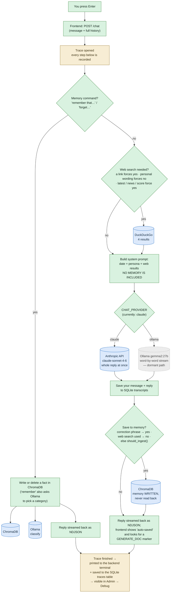
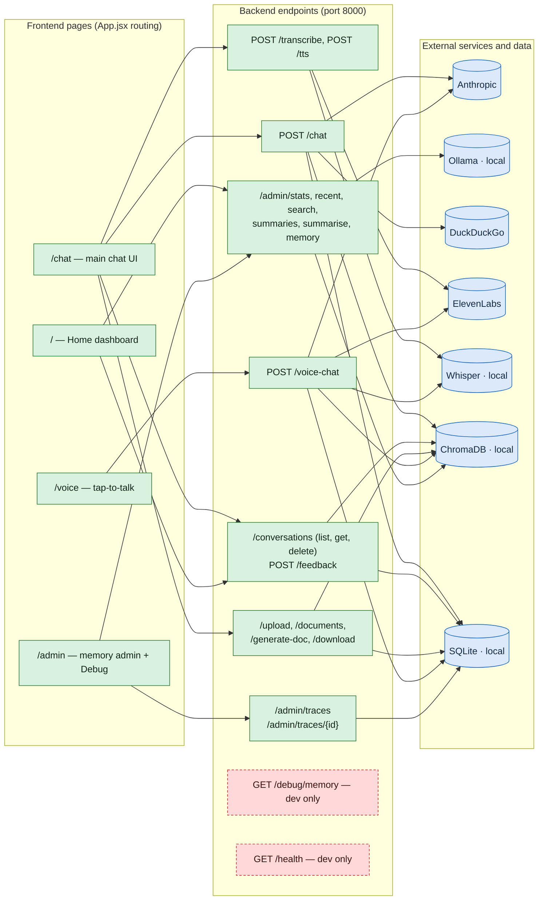

# Lucchese — Full Repo Audit

*Regenerated 13 August 2026. Read-only analysis — no code was changed. Every claim cites the file and line it came from, or the search that came up empty.*

*Supersedes the 5 August version. Two things happened in between: all the PTPreps business code was deleted, and per-message tracing was built. Both changed this report substantially — see [Section 8](#8-what-changed-since-the-last-audit) for the diff if you read the old one.*

---

## 1. How to read this report

Every file and feature gets one of four labels:

| Label | Meaning |
|---|---|
| ✅ **USED** | Actively part of the running app. I say what it does and when it runs. |
| 💀 **UNUSED** | The app never touches it. Safe to delete (evidence given). |
| 🚧 **HALF-FINISHED** | Partially wired in: set up but never called, called but broken, or referencing code that no longer exists. |
| 🔧 **DEV-ONLY** | Not part of the app itself — tooling, scripts you run by hand, or config for development. |

**Plain-English rule:** every technical term is explained the first time it appears, in *italics like this*. Terms used throughout:

- ***Backend*** — the Python server (`backend/`, built with *FastAPI*, a Python web framework). It runs on your machine on port 8000 and does all the thinking.
- ***Frontend*** — the website (`frontend/`, built with *React*, a JavaScript UI library, and served by *Vite*, a development web server). It's just the screen; every real action is a network request to the backend.
- ***Endpoint*** — one URL the backend answers, e.g. `POST /chat` means "send a chat message here." A ***router*** is a group of endpoints defined in one file.
- ***LLM*** — large language model; the AI that writes the replies (Claude or a local model).
- ***Ollama*** — a program that runs LLMs locally on your own PC instead of calling a cloud API.
- ***ChromaDB*** — a database that stores text as *embeddings* (lists of numbers capturing meaning), so you can search by meaning rather than exact words. This is Lucchese's "memory." It lives in the folder `backend/chroma_db/`, inside your backend — it is not a separate server.
- ***SQLite*** — a simple database stored as a single file (`backend/conversations.db`). It stores the literal chat transcripts and the traces (ChromaDB stores the searchable "memories" distilled from them — two separate stores).
- ***RAG*** — "retrieval-augmented generation": look up relevant memories/documents first, paste them into the AI's instructions, then ask it to answer. This is the thing your app *sets up but never actually does* — see Finding 1.
- ***System prompt*** — the hidden instruction text sent to the LLM before your message ("You are Lucchese, the personal AI of Alex Hammond…"). Built fresh for every message in `build_system_prompt` ([chat.py:115](backend/routes/chat.py#L115)).
- ***Intercept*** — a shortcut check at the top of the chat endpoint: before doing a normal AI reply, the code checks "is this message actually a command?" (e.g. `remember that I train on Tuesdays`). If yes, it runs special code and skips the normal flow. **Only one intercept survives** — the memory command.
- ***Trace*** — the step-by-step record of what happened to one chat message: which path it took and why, what was searched, which model was called, how long each step took, and any errors. Written by [tracer.py](backend/routes/tracer.py), printed to the backend terminal, stored in SQLite, and browsable in the admin **Debug** tab. This is the app explaining itself.
- ***NDJSON*** — "newline-delimited JSON": the backend streams the reply as one small JSON object per line (`{"type":"token","content":"Hi"}`), which is how the frontend shows text appearing live.
- ***Environment variable / .env*** — settings and secrets (API keys, which AI provider to use) kept in `backend/.env`, loaded at startup.

---

## 2. Key findings

### Finding 1 — Memory is written but never read. 🚧 *(still the most important thing in this repo)*

- **Writing works, from four directions.** After each reply, if your message looks personal or corrective, the exchange is saved to ChromaDB ([chat.py:371-401](backend/routes/chat.py#L371-L401) → `ingest_exchange` in [memory.py:200](backend/routes/memory.py#L200)). The 👍 button saves too ([conversations.py:84-90](backend/routes/conversations.py#L84-L90)), "remember that…" saves explicitly ([memory.py:564](backend/routes/memory.py#L564)), and uploaded documents are chunked in ([files.py:62](backend/routes/files.py#L62)).
- **Reading never happens.** `build_system_prompt` takes exactly one input — web results ([chat.py:115](backend/routes/chat.py#L115)). No memory parameter exists.
- **The retrieval machine is fully built and now completely unreachable.** `search_memory` ([memory.py:378](backend/routes/memory.py#L378)) searches all five collections, asks Ollama to rephrase your query for better matching, re-ranks results with a *cross-encoder* (a small model that scores how relevant each memory is), and adds recency bonuses. It has **zero callers and zero imports** anywhere in the app — searched every `.py` file in `backend/routes/`: the only hits are its own definition and a stale docstring line in [voice.py:10](backend/routes/voice.py#L10). The intercept that used to call it was deleted with the business code, and `chat.py` stopped importing it in commit `da54368`.
- Loading `memory.py` still downloads and loads **two ML models at every startup** — the embedding model ([memory.py:40-43](backend/routes/memory.py#L40-L43)) and the reranker ([memory.py:53](backend/routes/memory.py#L53)). The reranker is used by nothing.
- Voice chat's memory lookup is literally commented out ([voice.py:135](backend/routes/voice.py#L135): `# ctx = await build_context(user_text)`).

**Net effect: Lucchese diligently files memories it can never recall.** Asking "what have I told you about X?" gets you an answer based only on the current conversation and the hardcoded persona. Fixing this is the highest-value change available (Section 7).

### Finding 2 — Tracing works, and covers `/chat` only. ✅ 🚧

Every `POST /chat` now opens a trace and records each step ([chat.py:172](backend/routes/chat.py#L172)). Readable lines print to the terminal as the message processes, and the full record goes to the `traces` table in SQLite, capped at the newest 500 ([database.py:187-215](backend/routes/database.py#L187-L215)). Verified live: the running backend has traced real messages, each with 8 steps carrying full detail.

The gap: **`/voice-chat` is not traced.** It runs its own copy of the pipeline ([voice.py:113-214](backend/routes/voice.py#L113-L214)) — own prompt build, own model call, own ingest decision — and creates no trace. Speak to Lucchese instead of typing and the Debug tab shows nothing.

### Finding 3 — The admin key ships to every visitor's browser. ⚠️

`AdminPanel.jsx` reads the key from `VITE_ADMIN_KEY` ([AdminPanel.jsx:379](frontend/src/AdminPanel.jsx#L379) and 8 other call sites). Anything prefixed `VITE_` is **baked into the public JavaScript bundle** by Vite, so anyone who opens the site's source can read your admin key and call `DELETE /admin/memory`. Unchanged since the last audit.

### Finding 4 — Which endpoints the frontend actually calls

The backend defines **23 endpoints**. The frontend calls **21** of them:

| Endpoint | Called from | When |
|---|---|---|
| `POST /chat` | [App.jsx:495](frontend/src/App.jsx#L495) | Every chat message |
| `GET /conversations` | App.jsx, Home.jsx | Page load, after each reply |
| `GET /conversations/{id}` | [App.jsx:467](frontend/src/App.jsx#L467) | Clicking a conversation in the sidebar |
| `DELETE /conversations/{id}` | [App.jsx:480](frontend/src/App.jsx#L480) | Trash icon on a conversation |
| `POST /feedback` | [App.jsx:155](frontend/src/App.jsx#L155) | 👍/👎 on the latest reply |
| `POST /upload` | [App.jsx:300](frontend/src/App.jsx#L300) | Uploading a PDF/TXT/MD in the Documents panel |
| `GET /documents` | App.jsx, Home.jsx | Opening Documents panel, Home page load |
| `DELETE /documents/{id}` | [App.jsx:312](frontend/src/App.jsx#L312) | Deleting an uploaded document |
| `POST /generate-doc` | [App.jsx:50](frontend/src/App.jsx#L50) | "Save as Word Doc" (when a reply contains the `[GENERATE_DOC: …]` marker) |
| `GET /download/{token}` | [App.jsx:67](frontend/src/App.jsx#L67) | Downloading the generated .docx |
| `POST /transcribe` | [App.jsx:627](frontend/src/App.jsx#L627) | Mic button in chat (speech → text into the input box) |
| `POST /tts` | [App.jsx:674](frontend/src/App.jsx#L674) | Voice-mode toggle in chat (reads replies aloud) |
| `POST /voice-chat` | [Voice.jsx:153](frontend/src/Voice.jsx#L153) | The /voice page's tap-to-talk circle |
| `GET /admin/stats` | AdminPanel.jsx, Home.jsx | Admin page + Home page stats |
| `GET /admin/recent`, `/admin/search`, `/admin/summaries`, `POST /admin/summarise`, `DELETE /admin/memory` | AdminPanel.jsx | Admin page tabs and buttons |
| `GET /admin/traces` | [AdminPanel.jsx:393](frontend/src/AdminPanel.jsx#L393) | Opening the Debug tab / Refresh |
| `GET /admin/traces/{id}` | [AdminPanel.jsx:410](frontend/src/AdminPanel.jsx#L410) | Clicking a message in the Debug tab |

**The two nothing calls:**

| Endpoint | Defined at | Notes |
|---|---|---|
| `GET /debug/memory` | [admin.py:253](backend/routes/admin.py#L253) | 🔧 Dev inspection tool (needs admin key). Fine to keep or delete. |
| `GET /health` | [files.py:146](backend/routes/files.py#L146) | 🔧 Useful for manual "is it up?" checks / uptime monitors, but nothing in the app uses it. |

**Six routers are mounted** in [main.py:77-82](backend/main.py#L77-L82): chat, admin, conversations, files, voice, traces. `config.py`, `database.py`, `documents.py`, `memory.py`, `tracer.py` are used as libraries (imported by the mounted routes). `scrape.py` declares a `router` that main.py never mounts — see Section 5.

### Finding 5 — Which external services are actually exercised

Your current setting is `CHAT_PROVIDER=claude` in `backend/.env`, which decides a lot below.

| Service | Status | Evidence |
|---|---|---|
| **Anthropic (Claude)** | ✅ Runs **every chat and voice reply**. Model `claude-sonnet-4-6`, now in two places: the `CLAUDE_MODEL` constant ([chat.py:36](backend/routes/chat.py#L36)) and still hardcoded in [voice.py:158](backend/routes/voice.py#L158). Note the Claude path does **not** stream — it waits for the whole reply, then sends it as one chunk. Only the Ollama path streams word-by-word. |
| **Ollama (local LLM)** | ✅ but only in the background. Categorising "remember that…" facts ([memory.py:110](backend/routes/memory.py#L110)), the Admin "Summarise" button ([admin.py:139](backend/routes/admin.py#L139)), and query rephrasing inside the never-reached `search_memory`. Since `CHAT_PROVIDER=claude` it no longer writes chat replies. `start.bat` still boots it — correct, because "remember" and Summarise silently degrade without it. **The trace shows exactly when it's used**: a "remember" message records a `classify` step naming the model; a normal chat message records that classification was deferred. |
| **Whisper (local speech-to-text)** | ✅ Mic button (`/transcribe`) and voice page (`/voice-chat`). The `tiny` model (fastest, least accurate) is loaded when the backend starts ([config.py:29](backend/routes/config.py#L29) — the TODO comment about it blocking startup is still there). |
| **ElevenLabs (text-to-speech)** | ✅ `/tts` (voice-mode toggle in chat) and `/voice-chat`. Skipped gracefully if the API key is unset ([config.py:25](backend/routes/config.py#L25)). |
| **DuckDuckGo (web search)** | ✅ On trigger words only — "latest", "news", "score", a URL in the message, etc. ([chat.py:47-78](backend/routes/chat.py#L47-L78)). Failures no longer vanish: they're recorded as an error step in the trace ([chat.py:104-111](backend/routes/chat.py#L104-L111)). |
| **ChromaDB** | ✅ as an embedded library (write-heavy, read-starved per Finding 1). ⚠️ `chroma_client.py` configures a *different* ChromaDB — a separate server on port 8001 — that the app never uses; only the manual script `check_chroma.py` imports it. |
| **Google Sheets, Shopify** | 💀 **Gone.** `sheets.py`, `shopify_api.py` and `routes/shopify.py` were deleted with the business code. Zero references remain in `backend/` or `frontend/src`. |

---

## 3. Diagram: what happens when you send a chat message

Green = works and runs. Grey = configured but effectively dormant. Blue = external service touched. Gold = the tracing that records all of it.

Things worth knowing that the diagram implies:

- **There is only one intercept left.** The old Shopify, action-plan and scrape intercepts are gone. A message is either a memory command or a normal chat message — and the trace's first real step tells you which, and why.
- The forget pattern is still greedy: any message containing "forget " matches ([memory.py:509](backend/routes/memory.py#L509)) and will try to **delete** the closest-matching memories instead of chatting. *"Don't forget to order chicken"* is a memory-deletion command. The trace now makes this visible after the fact — it records the exact pattern that matched — but it doesn't prevent it.
- "Streaming" is real only on the dormant Ollama path. On Claude, the typing effect you see is the frontend rendering one big chunk.
- The trace is finished *after* the reply has been streamed ([chat.py:416](backend/routes/chat.py#L416)), so recording it never delays your answer.
- The `[GENERATE_DOC: name]` marker is a deal between the system prompt ([chat.py:148-149](backend/routes/chat.py#L148-L149)) and the frontend ([App.jsx:9](frontend/src/App.jsx#L9)): when a reply ends with it, a "Save as Word Doc" button appears, which calls `/generate-doc` → `python-docx` builds a .docx → `/download/{token}` fetches it (link expires after 15 minutes). This whole chain **works**.

---

## 4. Diagram: the whole app at a glance

One quirk: the Home page hardcodes the **production** backend URL `https://api.lucchese.app` ([Home.jsx:3](frontend/src/Home.jsx#L3)) while every other page uses the `VITE_API_URL` setting with production as fallback. If you ever run purely locally, Home's stats will silently come from (or fail against) the live server.

---

## 5. File-by-file classification

### Repo root

| File/folder | Status | What it is / evidence |
|---|---|---|
| `start.bat` | 🔧 | Your launcher: starts Ollama, the backend (uvicorn on 8000), the frontend (Vite on 5173), and a *Cloudflare tunnel* (exposes your PC to lucchese.app). Dev-only but essential. Hardcodes `C:\LuccheseOld\` paths. |
| `CLAUDE.md` | ✅ | Project brief for AI coding sessions — what the app is, the stack, the chat pipeline, conventions, known gaps. Read first each session. |
| `STATE.md` | ✅ | Session handoff: what got done, what's next, what's half-finished. Overwritten each session, not appended. |
| `docs/decisions.md` | ✅ | Why things are the way they are — 6 entries covering the business-code removal, the four tracing decisions, and the provider switch. |
| `AUDIT.md` | — | This report. |
| `.gitignore` | 🔧 | Tells git which files to never commit (secrets, databases, logs). Working as intended. |
| `cloudfare id.txt` | 🔧 | 36-byte note holding your tunnel ID. Gitignored. Keep. |
| `Archive/` | 💀 | Graveyard of pre-refactor code: old `deal.py`, `roleplay.py`, `state.py`, import scripts, an old `venv`, `node_modules`, big JSON exports. Nothing imports from it (not on the Python path, gitignored). **Safe to delete entirely** — everything of value is in git history. ~350 MB reclaimable. |
| `.claude/` | 🔧 | Now empty — the five stale agent-definition files were deleted in `ce75d6a`. |

### backend/ (root)

| File | Status | What it is / evidence |
|---|---|---|
| `main.py` | ✅ | App entry point: CORS setup, the `lucchese.context` logger, database init, mounts the 6 routers. The logger is no longer half-finished — it's what prints traces to your terminal and mirrors them to a rotating 5 MB × 5 log file ([main.py:14-56](backend/main.py#L14-L56)). |
| `.env` | ✅ | Secrets and settings: API keys, provider switch, admin key. Gitignored. |
| `requirements.txt` | ✅ | Python dependency list (119 lines). Minor: still pins **both** `ddgs==9.14.2` and `duckduckgo_search==8.1.1` — the code only imports `ddgs` ([chat.py:27](backend/routes/chat.py#L27)); the other is an older duplicate. |
| `conversations.db` | ✅ | The SQLite database: chat transcripts **and** the `traces` table. Live data, correctly gitignored. |
| `chroma_db/` | ✅ | The ChromaDB memory files. Live data. |
| `generated_docs/` | ✅ | Where generated Word docs sit for their 15-minute download window. |
| `lucchese.context.log` | ✅ | The trace log. Was 99% startup noise; now it's the plain-text history of every chat message. Rotates at 5 MB, 5 backups. |
| `imports.db` | 💀 | 18 MB SQLite file from the old ChatGPT/Grok import pipeline. **No reference to `imports.db` in any current code** (the scripts that used it live in `Archive/`). Safe to delete. |
| `chroma_client.py` | 💀 | Connects to a ChromaDB *server* on port 8001 — a different setup than the app uses (the app embeds ChromaDB directly, [memory.py:44](backend/routes/memory.py#L44)). Only `check_chroma.py` imports it. Delete both or keep as dev tools knowingly. |
| `check_chroma.py` | 🔧 | Hand-run script: "is ChromaDB alive, what's in it." Only useful if you run a Chroma server on 8001, which the app doesn't. |
| `inspect_memory.py` | 🔧 | Genuinely useful hand-run CLI for browsing memory collections (`python inspect_memory.py stats / sample / search`). Keep. |
| `export_conversations.py` | 🔧 | Hand-run exporter: dumps `conversations.db` to JSON. Keep. |
| `raw/` | 🔧 | Old ChatGPT export data + `extract.py`. One-time import material; archivable. ⚠️ Two files in here are committed to git — see Section 7. |
| `venv/`, `__pycache__/` | 🔧 | Python's installed packages / compiled cache. Never touch, never commit. |

### backend/routes/

| File | Status | What it is / evidence |
|---|---|---|
| `chat.py` | ✅ | The heart of the app — `POST /chat`, now with one intercept (memory commands) and a trace step around every stage. Clean: the dangling imports, the dead `_personal_signals` lines and the stale docstring are all gone. `needs_web_search()` and `should_ingest()` return *why*, not just yes/no, so the trace can explain the decision in English. |
| `tracer.py` | ✅ | **New.** The `Trace` class: `add_step()`, a `step()` context manager that times a block and records any exception, and `finish()` which prints the readable trace and saves it. Every method is exception-guarded, and `current()` returns a no-op object when no trace is active — so instrumenting a function never changes its signature or how it fails. |
| `traces.py` | ✅ | **New.** `GET /admin/traces` (newest-first summaries) and `GET /admin/traces/{id}` (one full trace, steps parsed). Both behind `verify_admin_key`. |
| `memory.py` | ✅ / 💀 | All ChromaDB operations. Writing (`ingest_exchange`, `ingest_document`, remember/forget) is ✅ used and now traced. `search_memory` + `expand_query` + the cross-encoder reranker are 💀 — fully built, **zero callers, zero imports** (Finding 1). Loading this module loads two ML models at startup, one of which is used by nothing. |
| `database.py` | ✅ / 🚧 | SQLite layer: conversations, messages, document records, and the `traces` table with its 500-row retention — all used. 🚧: the `roleplay_sessions` table and its three helper functions ([lines 239-271](backend/routes/database.py#L239-L271)) belong to the deleted roleplay feature; nothing calls them. |
| `config.py` | ✅ | Loads env vars, the ElevenLabs client, the Whisper model, and the admin-key check. Imported as a library — it has no router and doesn't need one. The Whisper `tiny` model loads at import time (the in-code TODO flags this). |
| `conversations.py` | ✅ | List/read/delete conversations + the 👍/👎 feedback endpoint. Delete properly purges both SQLite and ChromaDB. |
| `files.py` | ✅ | Upload → extract text (`pypdf` for PDFs) → chunk → store in ChromaDB `documents` collection; also Word-doc generation endpoints and `/health`. All frontend-wired except `/health`. |
| `documents.py` | ✅ | The markdown→.docx converter and the 15-minute download-token store. Used by `files.py`. (No endpoints of its own — library file.) |
| `voice.py` | ✅ / 🚧 | `/transcribe`, `/tts`, `/voice-chat` — all used. 🚧 flecks: **not traced** (Finding 2); the memory lookup is commented out ([line 135](backend/routes/voice.py#L135)); the model name is still hardcoded ([line 158](backend/routes/voice.py#L158)); and the docstring ([lines 9-11](backend/routes/voice.py#L9-L11)) describes an `init_voice_state()` that doesn't exist and a `search_memory` it doesn't import. |
| `admin.py` | ✅ | The six memory-admin endpoints behind the `X-Admin-Key` header, plus dev-only `/debug/memory`. The "Summarise" button is the only thing that generates the per-topic memory summaries — which, like all memory, currently never reach the AI. |
| `scrape.py` | 💀 | Website scraper for the deleted `scrape <url>` command. **Nothing mounts it and nothing calls it** — its `router` ([line 22](backend/routes/scrape.py#L22)) has no endpoints and never reaches `main.py`. It also still carries the `homepage_html` variable bug. Safe to delete. |
| `__init__.py` | ✅ | Empty on purpose — makes `routes/` importable as a Python package. Required. |

### frontend/

| File | Status | What it is / evidence |
|---|---|---|
| `src/main.jsx` | ✅ | Boots React, renders `App`. |
| `src/App.jsx` | ✅ / 💀 | The chat UI, page routing, docs panel, mic/voice-mode, doc-download button. 💀 inside it: `encodeWAV` ([lines 11-40](frontend/src/App.jsx#L11-L40)) is defined and never called. |
| `src/AdminPanel.jsx` | ✅ | Memory dashboard with six tabs: overview, recent, search, summaries, manage, and **debug**. The Debug tab lists recent messages with path/model/duration/status, and opens each into a pipeline diagram plus a plain-English step timeline with the raw detail behind expanders. ⚠️ Reads the admin key from `VITE_ADMIN_KEY` (Finding 3). |
| `src/Home.jsx` | ✅ / 🚧 | The dashboard. 🚧: still advertises two **deleted features** — "Deal Analyser" and "Practice Pitch" — and hardcodes the production API URL ([line 3](frontend/src/Home.jsx#L3)). |
| `src/Voice.jsx` | ✅ | The tap-to-talk page. Records → `/voice-chat` → plays the reply audio. Careful iOS handling. |
| `src/index.css` | ✅ | Imported by `main.jsx`. |
| `src/App.css` | 💀 | Imported by nothing. Leftover from the Vite template. |
| `src/assets/hero.png`, `react.svg`, `vite.svg` | 💀 | No imports anywhere in `src/`. Template/one-off leftovers. |
| `index.html` | ✅ | Page shell + PWA tags (*PWA* = installable "add to home screen" web app). Cosmetic bug: the browser-tab title is still literally **"frontend"** ([line 7](frontend/index.html#L7)). |
| `public/manifest.json`, `icon-192.png`, `icon-512.png`, `favicon.svg` | ✅ | PWA install metadata + icons, all referenced by `index.html`/manifest. |
| `public/icons.svg` | 💀 | Referenced by nothing (searched `src/`, `index.html`, `manifest.json`). |
| `public/_redirects`, `public/_headers` | ✅ | Deploy config for Cloudflare Pages-style hosting: route all URLs to `index.html` (so `/chat`, `/admin` work on refresh) and set manifest headers. |
| `vite.config.js` | ✅ | Dev-server config incl. the `lucchese.app` allowed hosts. |
| `package.json`, `package-lock.json` | ✅ | Dependency lists. Lean — React, react-dom, react-markdown. |
| `eslint.config.js`, `README.md`, `.gitignore` | 🔧 | Lint config and the untouched default Vite README. |

---

## 6. Environment variables — the scorecard

| Variable | Status | Where it's used |
|---|---|---|
| `CHAT_PROVIDER` (=claude) | ✅ | The master switch — chat.py, voice.py. |
| `ANTHROPIC_API_KEY` | ✅ | Every chat/voice reply. |
| `OLLAMA_BASE_URL`, `MODEL_FAST` | ✅ | Background jobs: remember-classification, admin summarise (and the dormant Ollama chat path). |
| `MODEL_DEEP` | 💀 | Only reachable via a `deep` flag the frontend never sends (no occurrence in `frontend/src`), and only on the Ollama path. |
| `CHROMA_PATH` | ✅ | Where memory lives ([memory.py:25](backend/routes/memory.py#L25)). |
| `CHROMA_HOST`, `CHROMA_PORT` | 💀 | Only read by dead `chroma_client.py` — and then immediately overwritten by hardcoded values. |
| `ELEVENLABS_API_KEY`, `ELEVENLABS_VOICE_ID` | ✅ | `/tts`, `/voice-chat`. |
| `ADMIN_API_KEY` | ✅ | Backend check for all `/admin/*` calls, including the two trace endpoints. |
| `VITE_API_URL` (frontend) | ✅ | Used by App/Voice/AdminPanel — but not Home.jsx. |
| `VITE_ADMIN_KEY` (frontend) | ⚠️ | Used — but ships to every visitor's browser by design of Vite env vars (Finding 3). |

*Gone since the last audit: `SHOPIFY_STORE`, `SHOPIFY_CLIENT_ID`, `SHOPIFY_CLIENT_SECRET`, `APPSTLE_API_KEY` — all removed with the business code.*

---

## 7. What I'd do about it — prioritized

### A. Worth finishing (highest value first)

1. **Wire memory reading into chat.** This is the payoff for everything the app already does: `search_memory()` works, the reranker works, summaries exist — the results just never reach the prompt. The change is small: in the normal chat flow, call `await search_memory(req.message)` and add a section to `build_system_prompt`. Until this is done, Lucchese has amnesia with a full filing cabinet. **This is now much safer to attempt than it was in August** — wrap the call in a trace step and the Debug tab will show you exactly what it retrieved and what it cost in milliseconds, per message. (Trade-off to measure: it adds an Ollama query-expansion call plus a rerank; you can skip `expand_query` for speed.)
2. **Trace `/voice-chat` too, or make it share the chat pipeline.** Voice runs a second, untraced copy of the whole flow ([voice.py:113-214](backend/routes/voice.py#L113-L214)) that drifts from `chat.py` — it already misses tracing, and it hardcodes the model name. Either open a trace in it the same way `chat.py` does, or refactor both onto one shared function.
3. **Tighten the "forget" pattern.** Any sentence containing "forget " deletes memories ([memory.py:509](backend/routes/memory.py#L509)). Require it at the start of the message.

### B. Safe to delete (evidence in Section 5; none of these are referenced by running code)

- `backend/routes/scrape.py` (mounted nowhere, no callers)
- `backend/chroma_client.py` + `backend/check_chroma.py` (they target a ChromaDB server you don't run)
- `backend/imports.db` (18 MB), `Archive/` (~350 MB incl. old venv/node_modules)
- The `roleplay_sessions` table + its three helpers in `database.py`
- Frontend: `encodeWAV` in App.jsx, `App.css`, `assets/hero.png`, `assets/react.svg`, `assets/vite.svg`, `public/icons.svg`
- `.env`: `MODEL_DEEP`, `CHROMA_HOST`, `CHROMA_PORT`; `requirements.txt`: `duckduckgo_search` (the code uses `ddgs`)
- If you ever decide memory reading isn't happening, `search_memory` / `expand_query` / the reranker go too — and startup gets noticeably faster. Decide before deleting; right now they're the raw material for item A1.

### C. Needs updating (works today, but has a catch)

1. **Admin key exposed in the browser.** `VITE_ADMIN_KEY` is compiled into the public JS bundle — anyone visiting lucchese.app can extract it and call your delete-memory endpoint. Options: keep the admin page local-only, or move to a login the backend checks per request without shipping the secret.
2. **Chat history committed to git.** Your secrets are properly ignored (`.env`, `conversations.db` are untracked), **but** `backend/raw/conversations_export.json` and `backend/raw/extracted_user_messages/user_messages.jsonl` — real exports of your conversations — are committed. Worth `git rm --cached`-ing and adding to `.gitignore` if this repo might ever be shared.
3. **Home page advertises dead features.** Remove the "Deal Analyser" and "Practice Pitch" cards, and switch Home.jsx's hardcoded API URL to `VITE_API_URL` like the other pages.
4. **Small polish:** browser tab still says "frontend"; `claude-sonnet-4-6` should come from `.env` rather than a constant in `chat.py` plus a literal in `voice.py` (and it's an older model now); the Claude path doesn't stream (switch to the Anthropic streaming API if you want real live typing); Whisper is pinned to `tiny` (fine for speed, weakest accuracy); feedback on the *first* message of a new conversation posts `conversation_id: null` ([App.jsx:573](frontend/src/App.jsx#L573) captures the id before it's set).

---

## 8. What changed since the last audit

If you read the 5 August version, these are the claims that are no longer true:

| Then | Now |
|---|---|
| "Nothing writes to the `lucchese.context` logger during a chat" | It carries every trace, to console and file |
| "`search_memory`'s only caller is the action-plan intercept, which crashes" | That intercept is deleted. **Zero** callers, and no longer imported |
| Four intercepts run in order on every message (shopify, memory, action plan, scrape) | **One** — the memory command |
| Google Sheets hit on every single chat message; backend won't boot without `credentials.json` | Removed entirely; no such dependency |
| Two intercepts crash on `build_system_prompt(None, "", "")` | Both deleted; the function takes one argument |
| `.claude/agents/` holds 5 stale files; "no `CLAUDE.md` exists" | Agents deleted; `CLAUDE.md` and `STATE.md` both exist |
| `docs/` is an empty folder, safe to delete | Holds `decisions.md` |
| Six routers: chat, admin, conversations, files, voice, **shopify** | chat, admin, conversations, files, voice, **traces** |
| `startup_validator.py` — 901 dead lines | Deleted |
| Recommendation #3: "bring back per-chat logging (tiny)" | Done — it became the tracing feature |

---

*Method note: this pass re-read the full source of `main.py`, `chat.py`, `memory.py`, `database.py`, `config.py`, `conversations.py`, `files.py`, `voice.py`, `documents.py`, `tracer.py`, `traces.py`, `admin.py` (partial), `scrape.py` (partial), `AdminPanel.jsx`, and `docs/decisions.md`; enumerated every `@router` decorator and every `fetch()` call; checked the mounted routers in `main.py`, the current `.env` keys, the live `/admin/traces` output from the running backend, and name-searches across `backend/routes/` and `frontend/src/` for each allegedly-unused symbol. Frontend claims about `App.jsx`/`Home.jsx`/`Voice.jsx` internals carry over from the 5 August read, spot-checked against current line numbers. Nothing was modified.*
